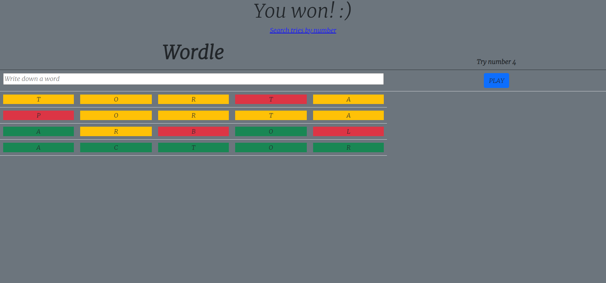
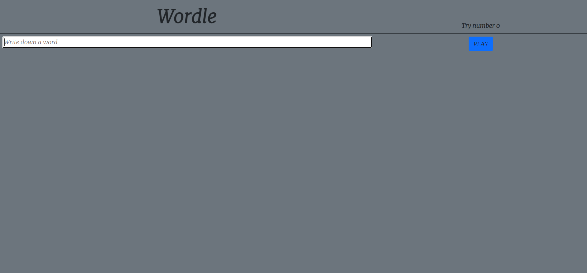
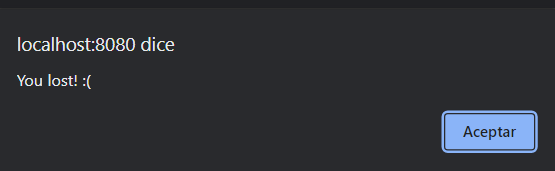
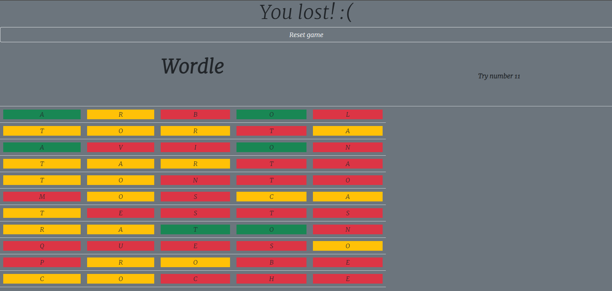
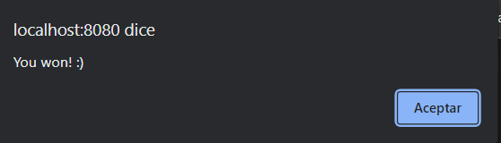
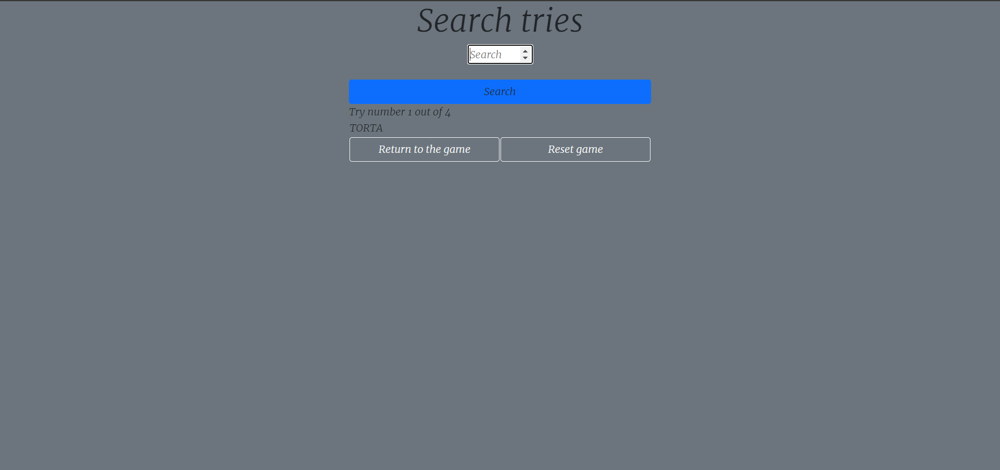

# Recuperación Examen DDI Springboot Guillermo Paricio

Este repositorio contiene una aplicación de Spring Boot desarrollada como parte del examen de recuperación de DDI.

## Empezando

Para ejecutar esta aplicación, es necesario tener Java y Maven instalados en su máquina, los pasos para ejecutarlo son los siguientes:

1. Clona este repositorio en su máquina local utilizando `git clone https://github.com/SalesianosZaragoza/recuperacion-wordle-GParicio`.
2. Navega hasta el directorio raíz del proyecto utilizando `cd recuperacion-wordle-GParicio`.
3. Ejecuta la aplicación utilizando `mvn spring-boot:run`.

La aplicación debería estar funcionando en `http://localhost:8080`.

## Presentación del proyecto

Este es mi proyecto de Wordle

Como podemos observar, tenemos un input donde introducir palabras, el número de intentos, un botón para enviar la palabra introducida y por último una tabla que se repite por cada palabra que hayamos introducido.

Cuando nos quedamos sin intentos (los cuales varían dependiendo del nivel de dificultad en el que estemos jugando), nos saltará un popup indicando que hemos perdido y además el menú de inicio cambiará, de forma que ya no nos dejará continuar escribiendo palabras y nuestra única opción será resetear la partida.

Cuando ganamos sin embargo, nos saltará también un popup pero esta vez avisándonos de que hemos ganado y el menú cambiará dejándonos acceder al buscador de intentos.

En el buscador de intentos, podremos introducir el número de intento dentro del rango de los intentos que hayamos empleado para sacar la palabra empleada en dicho intento. Además, podremos tanto volver a la partida como resetearla para volver a jugar.
